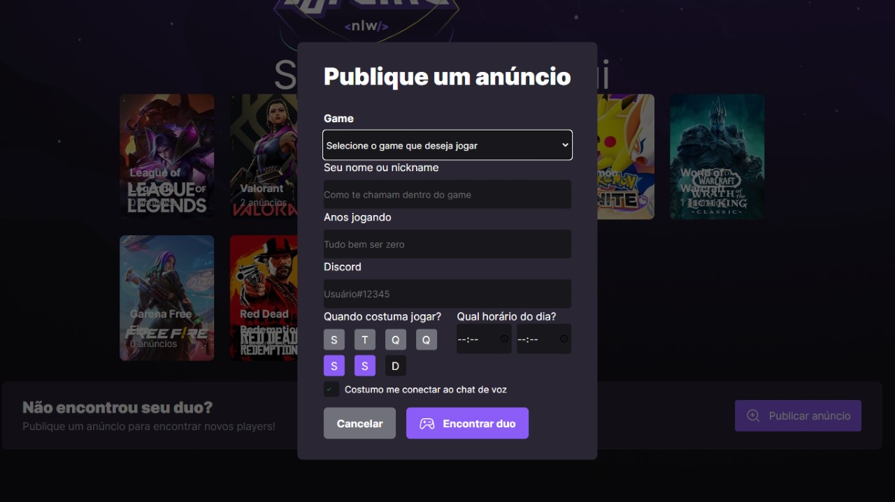

# Find Your Duo
An app that helps you find your gaming duo! Made with React in the frontend and Express in the backend.

## Running
Clonning the repo  
`$ git clone https://github.com/Gabx-dev/FindYourDuo`  
Running the server  
`$cd FindYourDuo/server`  
`$ npm run dev`  
And in another terminal  
`$ cd FindYourDuo/web`  
`$ npm run dev`  

## Frontend
* A landing page that lists all games and an ad count for each of then, along with a banner that lets you create your own ad.
* A create ad modal that prompts you to enter some info for the ad.
* All made with accessibility in mind so anyone on the web can use the app regardless of disability or temporary empairment.
## Backend
* Simple but powerful RESTful API made with Express.
* Database ORMs made with Prisma so querying and inserting data is quick and reliable.
## What did I learn
* Static typing with TypeScript
* Node.js ecosystem
* Reactive frontend with React
* REST API applied with Express
* Accessible UI design